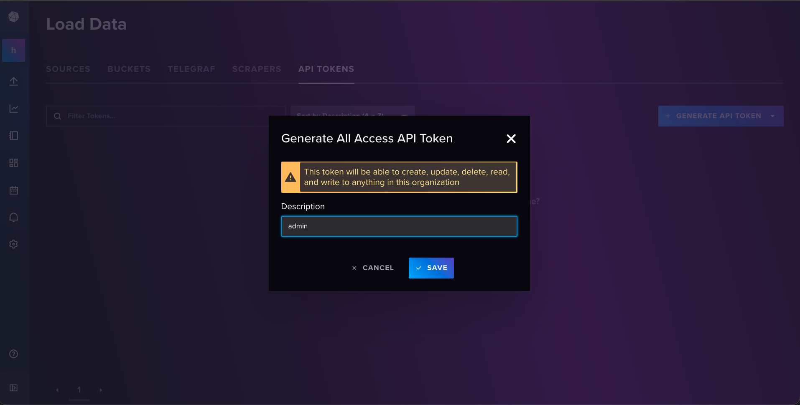
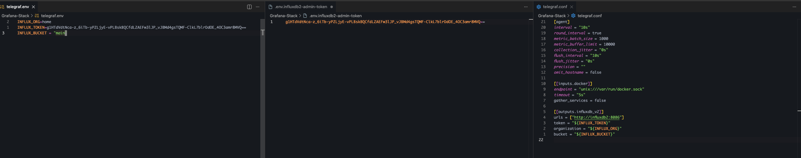
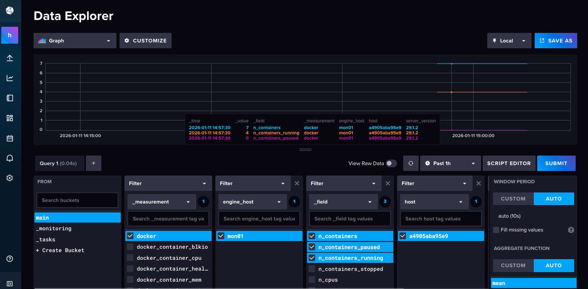

# Grafana Stack

## Setting up influxdb2 with telegraf

### Things I learned

- Docker compose secrets
- The order in which you prune mattters (obvious but I thought I was removing the volumes when I ran down, so my configs would be messed up)

**docker-compose**
Telegraf needs access to write to the influxdb using an API token which we set in the telegraf.conf
We also need to specify the org and the bucket in use

```bash

services:
 
<SNIP>

  influxdb2:
    image: influxdb:2
    container_name: influxdb2
    ports:
      - 8086:8086
    env_file:
      - ./influx.env
    secrets:
      - influxdb2-admin-username
      - influxdb2-admin-password
      - influxdb2-admin-token
    volumes:
      - type: volume
        source: influxdb2-data
        target: /var/lib/influxdb2
      - type: volume
        source: influxdb2-config
        target: /etc/influxdb2
<SNIP>
  telegraf:
    image: telegraf:latest
    container_name: telegraf
    restart: unless-stopped
    user: "1000:988"
    env_file:
      - ./telegraf.env
    volumes:
      - '/:/hostfs:ro' # to monitor docker-vm
      - './telegraf.conf:/etc/telegraf/telegraf.conf:ro'
      - '/var/run/docker.sock:/var/run/docker.sock:ro'
    depends_on:
      - influxdb2
<SNIP>

secrets:
  influxdb2-admin-username:
    file: ./.env.influxdb2-admin-username
  influxdb2-admin-password:
    file: ./.env.influxdb2-admin-password
  influxdb2-admin-token:
    file: ./.env.influxdb2-admin-token
volumes:
  grafana-storage: {}
  influxdb2-data: {} 
  influxdb2-config: {}
  prometheus_data: {}

```

**Secrets Files**

We defined the secrets that get mapped into our container in the following files.

```bash
p1erce@mon01:~/Homelab_Network/Services/Grafana-Stack$ cat .env.influxdb2-admin-token 
MyInitialAdminToken0==
p1erce@mon01:~/Homelab_Network/Services/Grafana-Stack$ cat .env.influxdb2-admin-username 
adminp1erce@mon01:~/Homelab_Network/Services/Grafana-Stack$ cat .env.influxdb2-admin-password 
Welcome1
```

**influx.env**

```bash
DOCKER_INFLUXDB_INIT_MODE=setup
DOCKER_INFLUXDB_INIT_ORG=home
DOCKER_INFLUXDB_INIT_BUCKET=main
DOCKER_INFLUXDB_INIT_RETENTION=0

DOCKER_INFLUXDB_INIT_USERNAME_FILE=/run/secrets/influxdb2-admin-username
DOCKER_INFLUXDB_INIT_PASSWORD_FILE=/run/secrets/influxdb2-admin-password
DOCKER_INFLUXDB_INIT_ADMIN_TOKEN_FILE=/run/secrets/influxdb2-admin-token
```

**telegraf.env**

```bash
INFLUX_ORG=home
INFLUX_TOKEN=MyInitialAdminToken0==
INFLUX_BUCKET = "main"
```

**telegraf.conf**

```toml
[agent]
interval = "10s"
round_interval = true
metric_batch_size = 1000
metric_buffer_limit = 10000
collection_jitter = "0s"
flush_interval = "10s"
flush_jitter = "0s"
precision = ""
omit_hostname = false

[[inputs.docker]]
endpoint = "unix:///var/run/docker.sock"
timeout = "5s"
gather_services = false

[[outputs.influxdb_v2]]
urls = ["http://influxdb2:8086"]
token = "${INFLUX_TOKEN}"
organization = "${INFLUX_ORG}"

```

**New API token**



**Setting new API token**

It's important to note that we must update the `telegraf.env` the `.env.influxdb2-admin-token` (docker-compose secrets) and make sure that our telegraf.conf is configured to accept this. You could hardcode into telegraf.conf if you wanted but I like this separation.

**docker**

```bash
p1erce@mon01:~/Homelab_Network/Services/Grafana-Stack$ docker restart telegraf influxdb2 
telegraf
influxdb2
```

**Completion**
When we return to our `main` bucket we should have everything right as rain.


## Settting up Grafana
