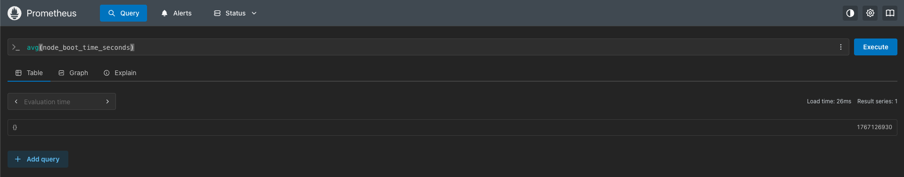

**Custom Docker Compose**
For addtional insights about grafana-setup view the [Grafana-Stack](https://github.com/HudsonPWesel/Homelab_Network/tree/master/Services/Grafana-Stack) 
Note this is just a testlab, don't actually expose your passwords.

```docker
services:
  grafana:
    image: grafana/grafana-enterprise
    container_name: grafana
    restart: unless-stopped
    ports:
      - '3000:3000'
    volumes:
      # - grafana-storage:/var/lib/grafana
      - '$PWD/data:/var/lib/grafana'
    user: '1000' # id -u 
    env_file:
      - ./grafana.env
  influxdb2:
    image: influxdb:2
    ports:
      - 8086:8086
    env_file:
      - ./influx.env
    secrets:
      - influxdb2-admin-username
      - influxdb2-admin-password
      - influxdb2-admin-token
    volumes:
      - type: volume
        source: influxdb2-data
        target: /var/lib/influxdb2
      - type: volume
        source: influxdb2-config
        target: /etc/influxdb2
  prometheus:
    image: prom/prometheus:v3.5.0
    volumes:
      - prometheus_data:/prometheus
      - ./prometheus.yml:/etc/prometheus/prometheus.yml
    ports:
      - 9090:9090
    restart: unless-stopped
  node-exporter:
    container_name: node-exporter
    image: prom/node-exporter:v1.9.0
    command:
      - "--path.rootfs=/host"
    volumes:
      - "/:/host:ro,rslave"
    pid: host
    restart: unless-stopped

secrets:
  influxdb2-admin-username:
    file: ./.env.influxdb2-admin-username
  influxdb2-admin-password:
    file: ./.env.influxdb2-admin-password
  influxdb2-admin-token:
    file: ./.env.influxdb2-admin-token
volumes:
  grafana-storage: {}
  influxdb2-data: {} 
  influxdb2-config: {}
  prometheus_data: {}
```

**Average Node boot time in seconds (Test Query)**

