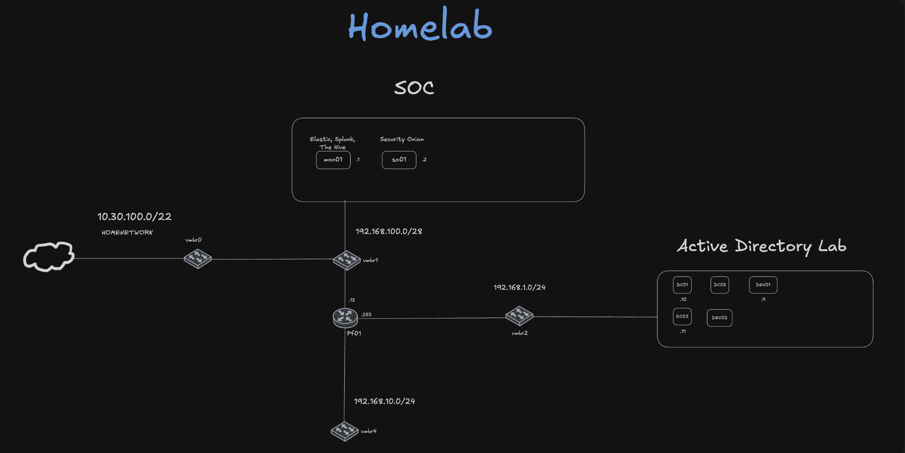

# Universe Homelab

# All Machines

| Hostname                      | Role                                         | Network(s)  | Services / Notes                                                |
| ----------------------------- | -------------------------------------------- | ----------- | --------------------------------------------------------------- |
| `pf01`                        | Main Firewall / Router                       | All         | pfSense routing, firewall, NAT, VPN                             |
| `DC01.testlab.local`          | Domain Controller (`testlab.local`)          | `LAB-LAN`   | Primary DC for testlab forest                                   |
| `DC02.internal.testlab.local` | Domain Controller (`internal.testlab.local`) | `LAB-LAN`   | Subdomain DC                                                    |
| `DC03.corelab.local`          | Domain Controller (`corelab.local`)          | `LAB-LAN`   | Core services forest DC                                         |
| `dev01`                       | Windows Client                               | `LAB-LAN`   | Sysmon, Splunk Universal Forwarder                              |
| `dev02`                       | Windows Client                               | `LAB-LAN`   | Sysmon, Splunk Universal Forwarder                              |
| `mon01`                       | SIEM & SOC Platform                          | `MGMT-LAN`  | Splunk Enterprise, Wazuh                                        |
| `so01`                        | Network Security Monitoring                  | `MGMT-LAN`  | Security Onion stack (Zeek, Suricata, alerts, PCAP, dashboards) |
| `mon02`                       | Infra & Metrics Monitoring                   | `MGMT-LAN`  | Prometheus, Grafana, Netdata, SNMP                              |
| `linux01`                     | Automation / Containers / DevOps             | `LINUX-LAN` | Docker, K3s, Portainer, GitLab, Nginx reverse proxy             |

# Core Network and Edge Security

## pf01

**Services**

- pfSense routing
- Firewall (stateful inspection, NAT)

**Notes**

- Primary perimeter device for all lab networks

# Active Directory Lab

## Forests / Domains

- `testlab.local`
  - `internal.testlab.local`
- `corelab.local`

## Domain Controllers

### DC01.testlab.local

**Services**

- AD DS
- DNS

**Notes**

- Primary DC for `testlab.local`

### DC02.internal.testlab.local

**Services**

- AD DS
- DNS

**Notes**

- DC for `internal.testlab.local`

### DC03.corelab.local

**Services**

- AD DS
- DNS

**Notes**

- DC for `corelab.local`

## Windows Clients

### dev01

**Services**

- Sysmon
- Splunk Universal Forwarder

**Notes**

- Endpoint telemetry generation

### dev02

**Services**

- Sysmon
- Splunk Universal Forwarder

**Notes**

- Comparative endpoint testing

# SOC / SIEM / Blue Team

### mon01

**Services**

- Splunk Enterprise
- Wazuh

**Notes**

- Central SIEM and SOC tooling

### so01

**Services**

- Security Onion
- Zeek
- Suricata

**Notes**

- Network security monitoring

# Monitoring and Observability

### mon02

**Services**

- Prometheus
- Grafana
- Netdata

**Notes**

- Infrastructure metrics and health

# Linux Infrastructure and Tooling

### linux01

**Services**

- Docker
- K3s
- Portainer
- GitLab
- Nginx reverse proxy

**Notes**

- Container hosting and automation

## Current Add-ons

- Active Directory
  - SCCM

### Planned Services

- LimaCharlie EDR
- Velociraptor (server + Windows/Linux agents)
